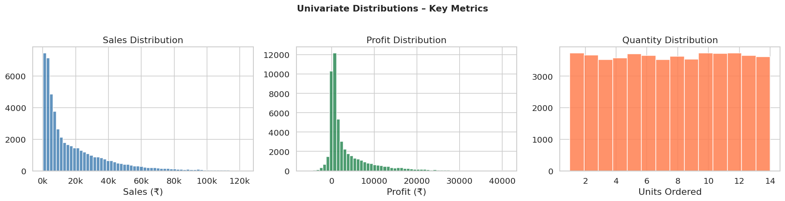
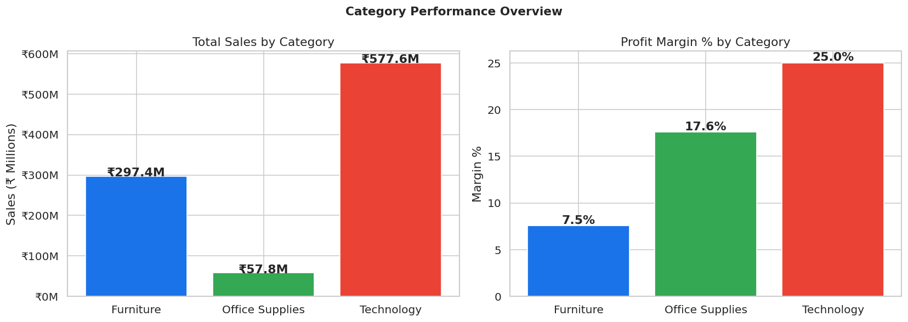
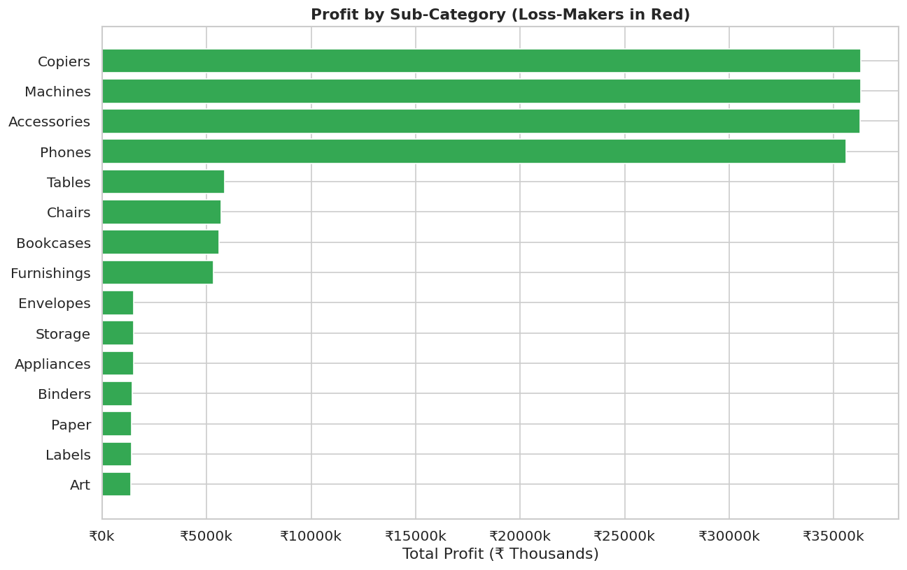
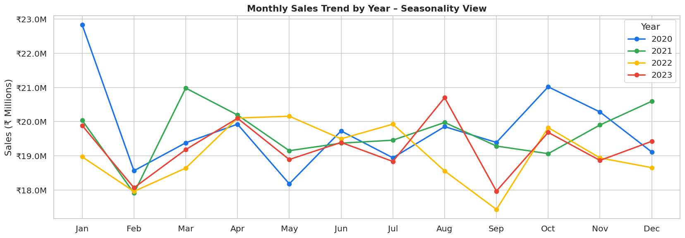
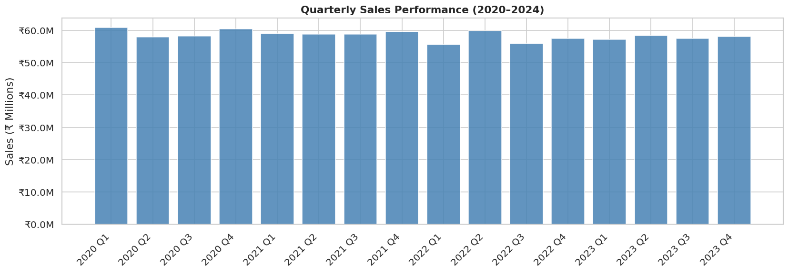
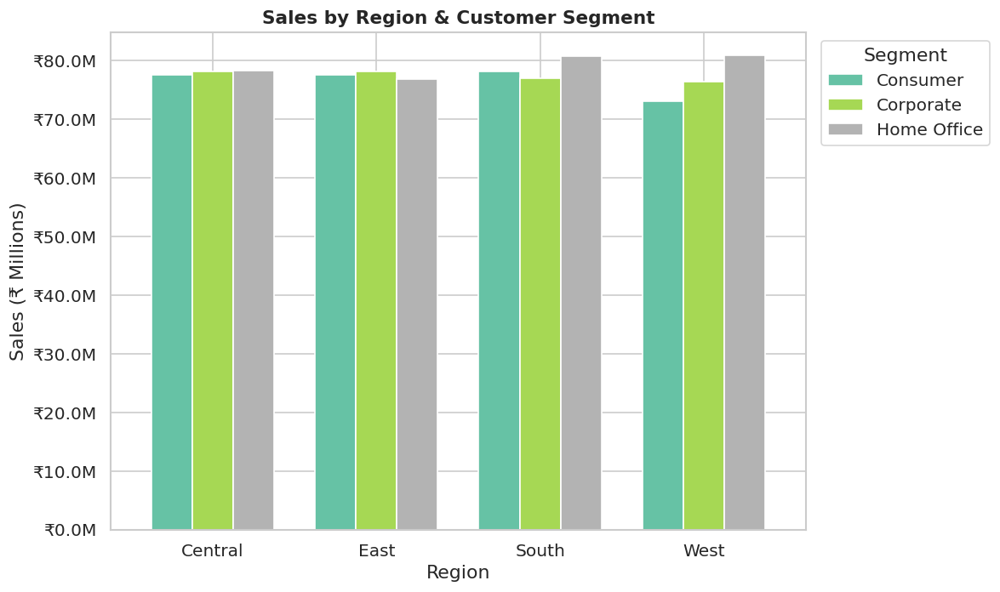
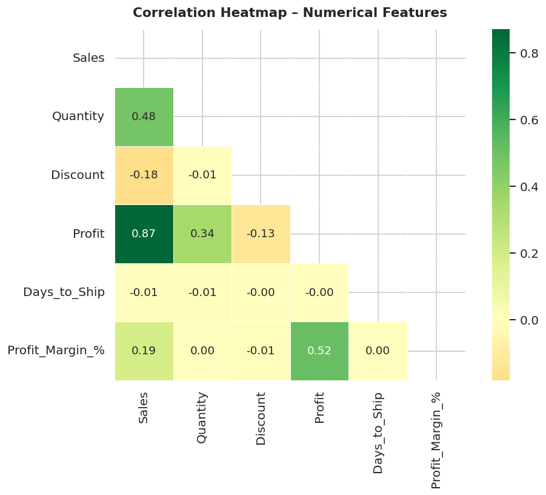
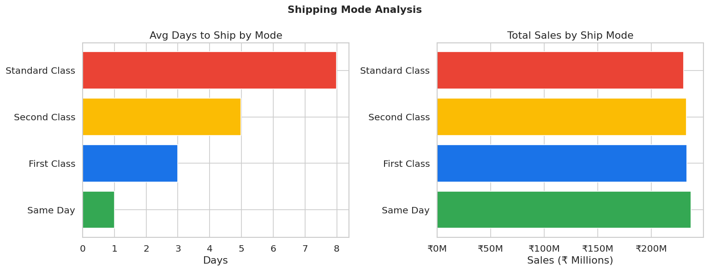

# 🛒 Exploratory Data Analysis – Global Superstore Dataset

A thorough EDA on a 51,000+ row retail dataset uncovering profitability patterns, seasonality, shipping behaviour, and loss-making sub-categories using Python and Jupyter Notebook.

---

## 📁 Project Structure

```
eda-global-superstore/
├── data/
│   └── global_superstore.csv       # 51,000+ retail transactions (2020–2024)
├── notebooks/
│   └── EDA_Global_Superstore.ipynb # Full executed notebook with outputs
├── images/                         # All exported visualisations
└── README.md
```

---

## 🎯 Objectives

1. Understand data structure, distributions, and quality
2. Identify profitability drivers across categories, regions, and segments
3. Detect seasonality and time-series trends in sales
4. Uncover loss-making sub-categories
5. Analyse shipping mode performance
6. Provide actionable business recommendations

---

## 📊 Dataset Overview

| Field | Description |
|-------|-------------|
| `Order_ID` | Unique order identifier |
| `Order_Date` / `Ship_Date` | Order and shipment dates |
| `Ship_Mode` | Standard / Second / First Class / Same Day |
| `Segment` | Consumer, Corporate, Home Office |
| `Category` / `Sub_Category` | Product hierarchy |
| `Sales`, `Quantity`, `Discount`, `Profit` | Key financial metrics |
| `Region`, `Country` | Geographic data |

---

## 🔍 Key Findings

| # | Insight |
|---|---------|
| 1 | **Technology** delivers the highest profit margins (~25%) |
| 2 | **Tables** sub-category is consistently loss-making at discounts > 30% |
| 3 | **Q4 (Oct–Dec)** shows a strong seasonal sales spike every year |
| 4 | **Discounts > 30%** strongly correlate with negative profit (r = −0.42) |
| 5 | **Standard Class** shipping carries 60%+ of volume but averages 7 days |
| 6 | **Corporate segment** generates better margins than Consumer |

---

## 📈 Visualisations

### Univariate Distributions


### Category Revenue & Margin


### Sub-Category Profit (Loss-makers highlighted)


### Monthly Seasonality Trend


### Quarterly Sales


### Region × Segment Sales


### Correlation Heatmap


### Shipping Mode Analysis


---

## ⚙️ How to Run

### Prerequisites
```bash
pip install pandas numpy matplotlib seaborn jupyter
```

### Run the Notebook
```bash
cd notebooks
jupyter notebook EDA_Global_Superstore.ipynb
```

Or view it directly on GitHub — the notebook renders with all outputs inline.

---

## 🛠️ Tech Stack

| Tool | Usage |
|------|-------|
| Python (Pandas, NumPy) | Data wrangling, feature engineering |
| Matplotlib & Seaborn | Statistical plots, heatmaps, time-series charts |
| Jupyter Notebook | Interactive, documented analysis |
| Git / GitHub | Version control with reproducible setup |

---

## 👤 Author

**Ashish Sharma**  
MCA Student – GL Bajaj Institute of Technology and Management  
📧 asishsharma245301@gmail.com  
🔗 [github.com/ashishsharma](https://github.com/ashishsharma)
